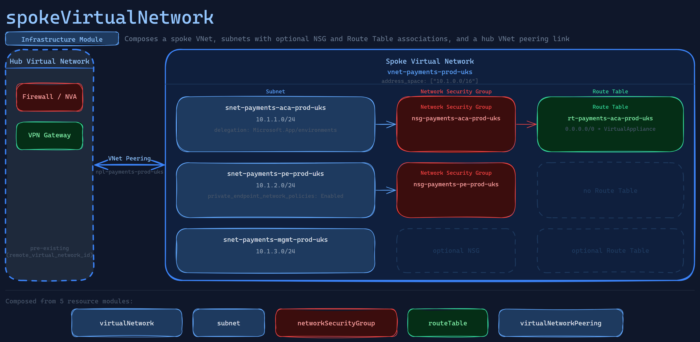

# spokeVirtualNetwork

Provisions a complete spoke Virtual Network for a hub-and-spoke topology, composing a Virtual Network, one-to-many subnets with optional NSG and route table associations, and a single outbound peering link to a hub Virtual Network.

## Requirements

| Name | Version |
|------|---------|
|  [terraform](#requirement\_terraform) | ~> 1.9 |
|  [azurerm](#requirement\_azurerm) | ~> 4.0 |

## Providers

No providers.

## Modules

| Name | Source | Version |
|------|--------|---------|
|  [hub\_peering](#module\_hub\_peering) | ../../../resource/network/virtualNetworkPeering | n/a |
|  [network\_security\_groups](#module\_network\_security\_groups) | ../../../resource/network/networkSecurityGroup | n/a |
|  [route\_tables](#module\_route\_tables) | ../../../resource/network/routeTable | n/a |
|  [subnets](#module\_subnets) | ../../../resource/network/subnet | n/a |
|  [virtual\_network](#module\_virtual\_network) | ../../../resource/network/virtualNetwork | n/a |

## Resources

No resources.

## Inputs

| Name | Description | Type | Default | Required |
|------|-------------|------|---------|:--------:|
|  [address\_space](#input\_address\_space) | A list of CIDR blocks that define the address space of the spoke Virtual Network (e.g. ["10.1.0.0/16"]). | `list(string)` | n/a | yes |
|  [application\_purpose](#input\_application\_purpose) | The purpose or workload name for this deployment, used as part of the resource naming convention (e.g. "payments", "api", "frontend"). | `string` | n/a | yes |
|  [dns\_servers](#input\_dns\_servers) | A list of custom DNS server IP addresses for the spoke Virtual Network. When empty, Azure-provided DNS is used. | `list(string)` | `[]` | no |
|  [environment](#input\_environment) | The deployment environment, used as part of the resource naming convention (e.g. "dev", "staging", "prod"). | `string` | n/a | yes |
|  [flow\_timeout\_in\_minutes](#input\_flow\_timeout\_in\_minutes) | The flow timeout in minutes for the spoke Virtual Network. Must be between 4 and 30. When null, the Azure default applies. | `number` | `null` | no |
|  [hub\_peering](#input\_hub\_peering) | Configuration for the Virtual Network Peering from this spoke to the hub Virtual Network.  Each object supports:   remote\_virtual\_network\_id    - (Required) The full resource ID of the hub Virtual Network.   allow\_forwarded\_traffic      - (Optional) Allow forwarded traffic through this peering. Defaults to true.   allow\_gateway\_transit        - (Optional) Allow gateway transit. Defaults to false (spoke side).   use\_remote\_gateways          - (Optional) Use the hub's gateway. Defaults to false.   allow\_virtual\_network\_access - (Optional) Allow cross-VNet resource access. Defaults to true.  Example:   hub\_peering = {     remote\_virtual\_network\_id = "/subscriptions/.../virtualNetworks/vnet-hub-prod-uks"   } | <pre>object({     remote_virtual_network_id    = string     allow_forwarded_traffic      = optional(bool, true)     allow_gateway_transit        = optional(bool, false)     use_remote_gateways          = optional(bool, false)     allow_virtual_network_access = optional(bool, true)   })</pre> | n/a | yes |
|  [location](#input\_location) | The Azure region where all spoke network resources will be created. | `string` | n/a | yes |
|  [network\_security\_groups](#input\_network\_security\_groups) | A map of Network Security Groups to create. The map key is used as a short identifier (e.g. "aca", "pe", "mgmt") and is appended to application\_purpose when naming the resource (e.g. "payments-aca").  Each object supports:   security\_rules - (Optional) List of security rules. See the networkSecurityGroup resource module for the full rule schema.  Example:   network\_security\_groups = {     aca = {       security\_rules = [         {           name                         = "allow-https-inbound"           priority                     = 100           direction                    = "Inbound"           access                       = "Allow"           protocol                     = "Tcp"           source\_port\_ranges           = ["*"]           source\_address\_prefixes      = ["10.0.0.0/8"]           destination\_port\_ranges      = ["443"]           destination\_address\_prefixes = ["*"]         }       ]     }   } | <pre>map(object({     security_rules = optional(list(object({       name                         = string       priority                     = number       direction                    = string       access                       = string       protocol                     = string       source_port_ranges           = list(string)       source_address_prefixes      = list(string)       destination_port_ranges      = list(string)       destination_address_prefixes = list(string)     })), [])   }))</pre> | `{}` | no |
|  [region](#input\_region) | The region abbreviation, used as part of the resource naming convention (e.g. "uks", "euw", "eus"). | `string` | n/a | yes |
|  [resource\_group\_name](#input\_resource\_group\_name) | The name of the resource group in which all spoke network resources will be created. | `string` | n/a | yes |
|  [route\_tables](#input\_route\_tables) | A map of Route Tables to create. The map key is used as a short identifier (e.g. "aca", "default") and is appended to application\_purpose when naming the resource.  Each object supports:   bgp\_route\_propagation\_enabled - (Optional) Whether BGP routes are propagated. Defaults to false.   routes                        - (Optional) List of routes. See the routeTable resource module for the full route schema.  Example:   route\_tables = {     aca = {       routes = [         {           name           = "default-to-firewall"           address\_prefix = "0.0.0.0/0"           next\_hop\_type  = "VirtualAppliance"           next\_hop\_in\_ip\_address = "10.0.0.4"         }       ]     }   } | <pre>map(object({     bgp_route_propagation_enabled = optional(bool, false)     routes = optional(list(object({       name                   = string       address_prefix         = string       next_hop_type          = string       next_hop_in_ip_address = optional(string)     })), [])   }))</pre> | `{}` | no |
|  [subnets](#input\_subnets) | A map of subnets to create within the spoke Virtual Network. The map key is used as a short identifier (e.g. "aca", "pe", "mgmt") and is appended to application\_purpose when naming the subnet.  Each object supports:   address\_prefixes                              - (Required) CIDR blocks for the subnet.   service\_endpoints                             - (Optional) Service endpoints to enable. Defaults to [].   private\_endpoint\_network\_policies             - (Optional) Network policy mode for private endpoints. Defaults to "Disabled".   private\_link\_service\_network\_policies\_enabled - (Optional) Enable network policies for private link service NICs. Defaults to false.   default\_outbound\_access\_enabled               - (Optional) Allow default outbound internet access. Defaults to false.   nsg\_key                                       - (Optional) Key from network\_security\_groups to associate with this subnet.   route\_table\_key                               - (Optional) Key from route\_tables to associate with this subnet.   delegation                                    - (Optional) Service delegation block.  Example:   subnets = {     aca = {       address\_prefixes = ["10.1.1.0/24"]       nsg\_key          = "aca"       route\_table\_key  = "aca"       delegation = {         name         = "aca-delegation"         service\_name = "Microsoft.App/environments"       }     }     pe = {       address\_prefixes                  = ["10.1.2.0/24"]       nsg\_key                           = "pe"       private\_endpoint\_network\_policies = "Enabled"     }   } | <pre>map(object({     address_prefixes                              = list(string)     service_endpoints                             = optional(list(string), [])     private_endpoint_network_policies             = optional(string, "Disabled")     private_link_service_network_policies_enabled = optional(bool, false)     default_outbound_access_enabled               = optional(bool, false)     nsg_key                                       = optional(string)     route_table_key                               = optional(string)     delegation = optional(object({       name            = string       service_name    = string       service_actions = optional(list(string), [])     }))   }))</pre> | n/a | yes |
|  [tags](#input\_tags) | A map of tags to assign to all resources in the spoke Virtual Network. | `map(string)` | <pre>{   "terraformDeployed": "true" }</pre> | no |

## Outputs

| Name | Description |
|------|-------------|
|  [hub\_peering\_id](#output\_hub\_peering\_id) | The resource ID of the Virtual Network Peering to the hub. |
|  [nsg\_ids](#output\_nsg\_ids) | A map of NSG key to Network Security Group resource ID. |
|  [route\_table\_ids](#output\_route\_table\_ids) | A map of route table key to Route Table resource ID. |
|  [subnet\_ids](#output\_subnet\_ids) | A map of subnet key to subnet resource ID. |
|  [subnet\_names](#output\_subnet\_names) | A map of subnet key to subnet name. |
|  [virtual\_network\_id](#output\_virtual\_network\_id) | The resource ID of the spoke Virtual Network. |
|  [virtual\_network\_name](#output\_virtual\_network\_name) | The name of the spoke Virtual Network. |
